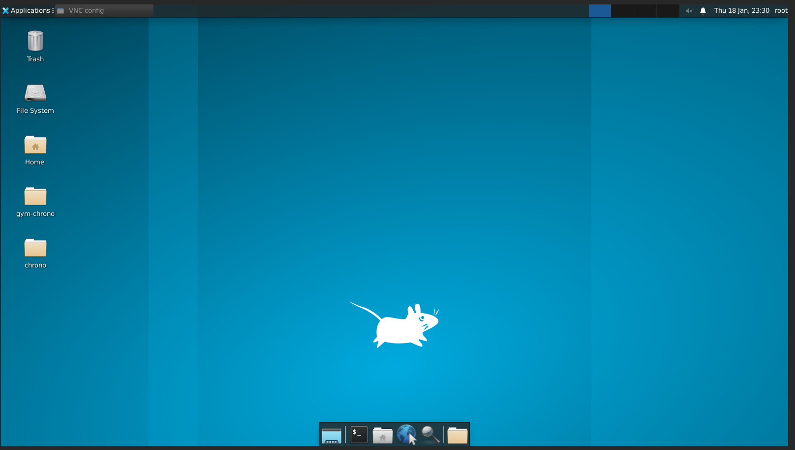
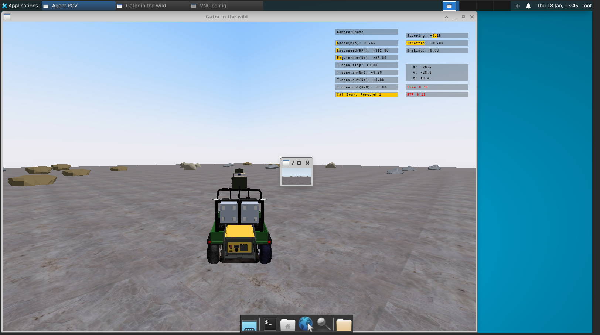

# GymChrono Docker Quickstart

## Table of Contents

- [Prerequisites](#prerequisites)
- [Building the Image](#building-the-image)
- [Starting the Container](#starting-the-container)
- [Attaching to the Container](#attaching-to-the-container)
- [Running a GymChrono Test](#running-a-gymchrono-test)

## Prerequisites

To be able to follow this quickstart guide, you must have:
- A modern browser installed (such as chrome)
- A copy of this repository cloned on a local machine
- [Docker](https://www.docker.com/get-started/) installed on your system
- The [OptiX 7.7.0](https://www.docker.com/get-started/) script for linux downloaded and placed in the `/gym-chrono/docker/optix/` directory

## Building the Image

Navigate to this folder, and run the following command in a bash shell:

```bash
docker build -t <REPOSITORY>:<TAG> .
```

with `<REPOSITORY>` replaced by the name you would like for the container, and a version number as the `<TAG>`.

> [!NOTE]
> Building and saving the container image may take a while as `chrono`, `cuda` and `stable-baselines3` must be built, and large amounts of data must be copied.

> [!NOTE]
> If the build fails on the final step, this may be due to google drive quotas being reached. If this is the case, it is recommended to wait 24 hours so the quotas reset, or comment [this](./Dockerfile#71) line, and run the `gymchrono.sh` script manually once starting the container.

## Starting the container

In order to run the container, run the following command in a bash shell:

```bash
docker run -d -p <LOCAL_PORT1>:5901 <LOCAL_PORT2>:6901 --gpus all <REPOSITORY>:<TAG>
```

In the above command, replace `<REPOSITORY>` and `<TAG>` with the names used in the [previous](#building-the-image) section. Replace `<LOCAL_PORT1>` and `<LOCAL_PORT2>` with the desired target ports for the service. For example, if ports 5901 and 6901 are not used by another service, these can be used. Otherwise, you may consider using other ports. A full example command is included below.

```bash
docker run -d -p 5902:5901 -p 6902:6901 --gpus all gymchrono:v1.0
```

## Attaching to the container

To view the output of the vnc service, go to your modern browser and in the address bar go to `localhost:<LOCAL_PORT2>` (in the above full example, this would be `local_host:6902`). You should be prompted for a password, which will be `sbel`. After entering the password, you should see this desktop appear:



To access a terminal window, you can either use the vnc gui, or attach to the container using the following command:

```bash
docker exec -it <CONTAINER_NAME> bash
```

and replacing `<CONTAINER_NAME>` with the name of the container, or the container id

> [!NOTE]
> You can get the name of the container or the container ID by running `docker ps`

## Running a GymChrono Test

To test that GymChrono is functioning as expected, navigate to `/sbel/Desktop/gym-chrono/gym_chrono/test` within the container, and run `python3 off_road_gator_test.py`. You should see the following rendering in your browser window:



> [!NOTE]
> Chrono::Robot is not currently functional in this container, so the Cobra demos will not work.